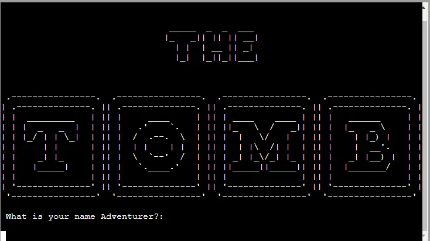
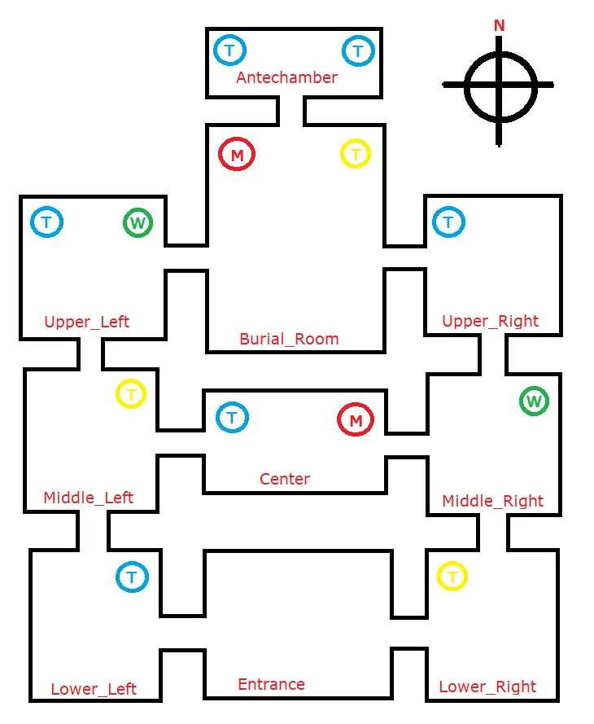
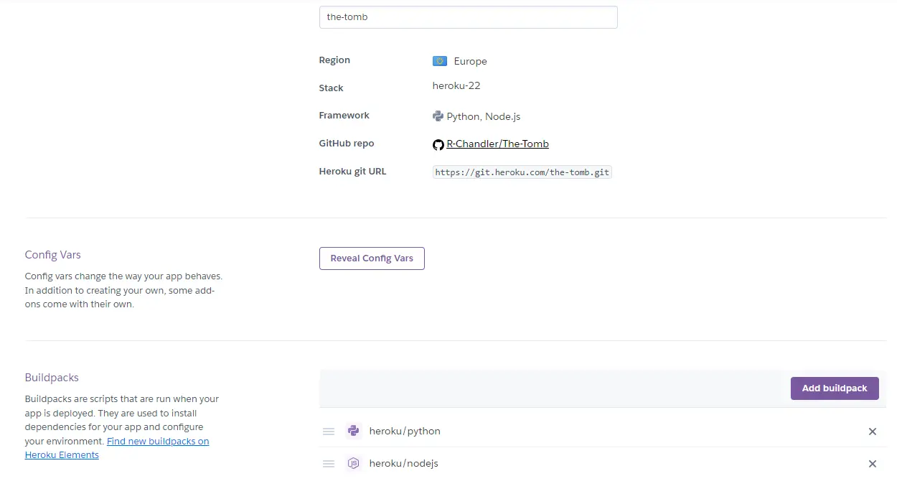
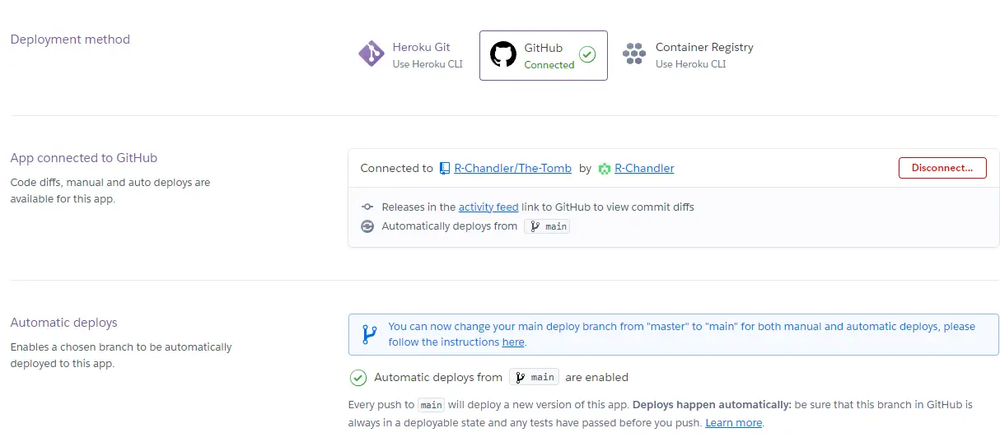

# The Tomb

The Tomb is a text adventure game based in a long forgotten egyptian tomb. The player is tasked with escaping the tomb themselves as they are trapped upon entering. There are monsters lurking within the darkness, with a weapon to find the player will be able to stave off these threats. However the monsters arent the only threat, if the players torch runs out they will be left to the mercy of the halls and a game over is certain. extra torches and treasure can be found throughout but can the route to freedom be revealed?

[Link to Live Site](https://the-tomb-48c17927017e.herokuapp.com/)

## User stories

#### First Time Visitor Goals
 - As a First Time Visitor, I want to find the instructions to be easy to follow and to find the game moderately challenging.
 - As a First Time Visitor, I want to know the player characters motivation and guide his journey through the game environment.
 - As a First Time visitor, I would like to know how successful i am being throughout the game and wether or not i can achieve a better score.

#### Returning Visitor Goals
 - As a Returning Visitor, I would want to continue to better my own score.
 - As a Returning Visitor, I would like to find new ways through the environment and any potential secrets it holds.

## Design
I used a hand drawn map to build the environment for the game and built my room functions around this design.

### Deployed Application
I made some small changes to the Python terminal template to improve the user experience while using the CLI.

## Features
- Fully functioning text adventure game with ways to fail and one way to succeed.
- A diminishing light level which reduces as the user moves throughout the environment, leading to failure unless additional torches are found.
- Use of the players name within the game.
- A scoring system which tracks treasure found, items found and monsters slain.
- A high score which tracks your highest score over multiple runs in the game.

### Future Features
- There is alot of scope to refactor the exsisting code to make it alot simpler to use.
- Going forward there are opportunities link to google sheets or a database to track users high scores.
- Additionally with refactoring the code i would look to make the tomb have a more random construction making each run through a different experience.

### Additional Considerations
If i had more time to work on this project i would like to add these additional features to the game / code.

- Coloured text to make the important pieces of text or headings stand out.
- Have the print statements display word by word instead of appearing instantaneously to improve readability.
- Convert the global variables into a player class to reduce the amount of code and improve its quality.
- Move the data structures holding the room data and the game instructions to a separate json file.

## Technologies Used
- Python 3
- Pip for installing additional Python packages
- GitHub for hosting the repository
- GitPod was used as the coding environment
- 
## Testing

I carried out constant testing throughout the building of each function using print statements to ensure the correct output was being achieved for each outcome. Once the complete dungeon was built i carried out several run throughs to ensure the game was functioning correctly.

### Live Testing
I carried out live testing after the application had been deployed to Heroku. Once the application was deployed to the final terminal size many issues regarding the readability were found and repaired. 
	
### Known Bugs

During final testing i discovered that (CTRL +C) otherwise known as SIGINT will crash the game when used. I will need to create a function to ensure that this input is caught and does not interfere with the game running.

## Deployment

### Heroku

The application was deployed to Heroku using the following steps:
1. Python and node.js buildpacks were added to the new pipeline settings so that the project template would be supported on the platform.

2. Deployement method was selected as GitHub which linked directly to my GitHib account where the correct repository was selected.
3. Once the correct repository was selected i used the automatic deployment from GitHub to ensure the deployed project is up to date with my repository.

The deployed project can be found using the below link.
[THE TOMB](https://the-tomb-48c17927017e.herokuapp.com/)
